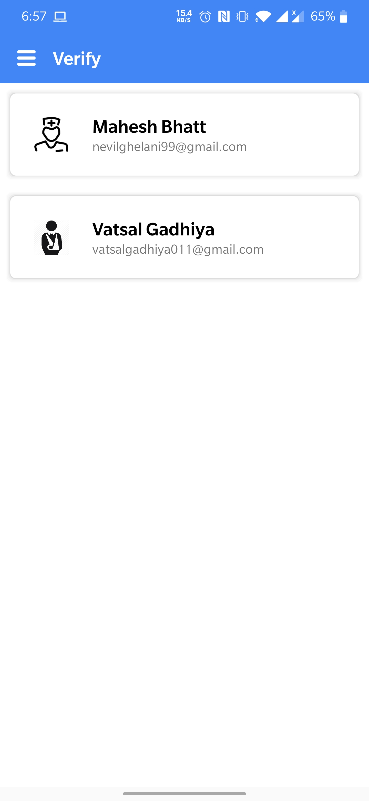

# Smart-Healthcare-Card
- Smart healthcare cards manage patient identity and give practitioners and pharmacists secure access to their medical records.
- The patient can be validated using a unique NFC-enabled health card which is allocated to each citizen and after that, the patient's health records can be obtained using an Android application with his/her permission. 
- This concept will help the government to create a centralized database of the health of citizens.

# Screenshots
   

  

  

  

  

  

  

